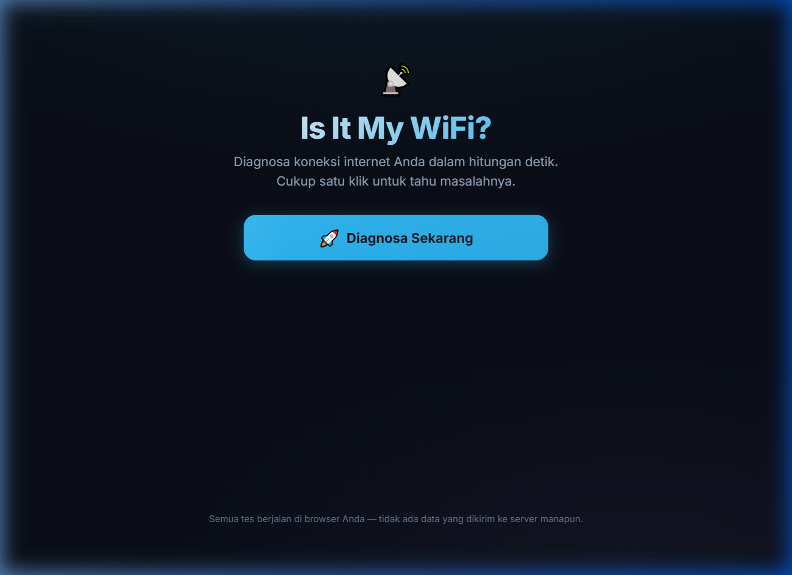
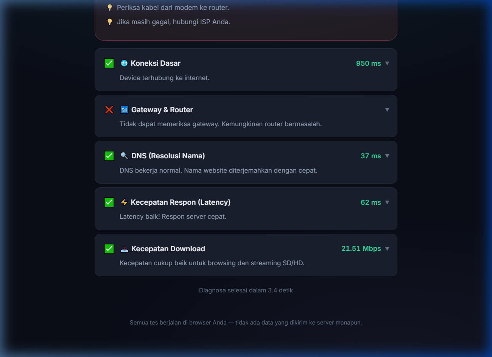
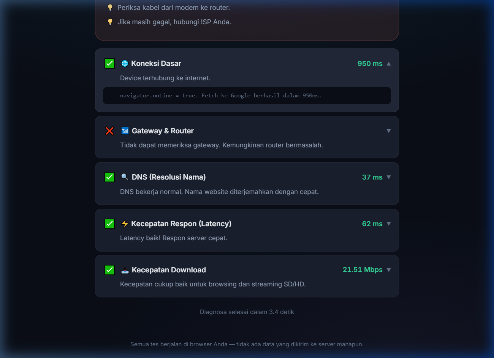

<div align="center">

# 📡 Is It My WiFi?

**One-click browser-based network diagnostic for non-technical users.**

Diagnosa koneksi internet Anda — tanpa install, tanpa server, 100% di browser.

[▶ Try the Live Demo](https://is-it-my-wifi.vercel.app) · [📄 PRD](docs/PRD.md) · [🐛 Report Bug](../../issues)

---



</div>

## 🎯 Problem

> Internet lambat, tapi user awam **tidak tahu** apakah masalahnya di device, WiFi, router, ISP, atau DNS.

Existing tools (speedtest.net, ping commands) require technical knowledge. **Is It My WiFi?** translates raw network diagnostics into plain-language verdicts with actionable recommendations — in one click.

## 💡 Solution

| Feature | Detail |
|---|---|
| **One-Click Diagnostic** | Single button runs 5 sequential network tests |
| **Plain-Language Verdicts** | "ISP Anda sedang bermasalah" instead of "latency: 450ms" |
| **Zero Backend** | 100% client-side — no server costs, no data collection |
| **Ad-Blocker Resilient** | Detects blockers and avoids false-positive "offline" errors |
| **Mobile-First** | Responsive dark-mode UI, 44px touch targets, ARIA accessible |

## 📸 Screenshots

<div align="center">

| Diagnostic Results | Expanded Test Detail |
|---|---|
|  |  |

</div>

## 🏗️ Architecture

```
Browser (Client-Side Only)
├── Diagnostic Engine     → 5 modular tests (gateway, DNS, latency, speed, online)
├── Ad-Blocker Detection  → Canary endpoint strategy (3 risk tiers)
├── Verdict Logic         → Decision tree → human-readable diagnosis
├── State Machine         → React hook with AbortController lifecycle
├── Microcopy Dictionary  → Technical errors → B2C Indonesian text
└── Telemetry             → Privacy-respecting event tracking (DNT-aware)
```

### Tech Stack

| Layer | Choice | Trade-off |
|---|---|---|
| **Framework** | Vite + React 18 + TypeScript | Fastest DX, tree-shaking, type safety for complex diagnostic logic |
| **Styling** | Vanilla CSS (no Tailwind) | Zero dependency, full control over design tokens, better performance |
| **Hosting** | Vercel (Free) | Global CDN, HTTPS, zero-config — $0/month |
| **Backend** | None | All logic runs in browser via `fetch()` timing + public endpoints |

### Why No Backend?

The entire diagnostic engine uses browser-native APIs:
- **`fetch()` timing** to Cloudflare/Google endpoints (latency measurement)
- **`no-cors` mode** for connectivity checks (bypasses CORS restrictions)
- **`performance.now()`** for high-resolution timing
- **WebRTC** for local network detection (best-effort)

This makes the app **free to host** and **privacy-preserving** — no user data touches any server.

## 🧩 Key Engineering Challenges

### 1. CORS Limitations
**Problem:** Browsers block cross-origin responses for security.
**Solution:** Used `mode: 'no-cors'` for timing-only tests (we don't need the response body — just whether the request succeeded and how long it took). DNS tests compare domain fetch vs direct IP fetch timing to isolate DNS overhead.

### 2. Ad-Blocker False Positives
**Problem:** Ad-blockers block `fetch()` to certain domains (especially `speed.cloudflare.com`), causing false "internet is down" results.
**Solution:** Built a **canary endpoint system** with 3 risk tiers. Pre-flight check runs before diagnostics. If a blocker is detected, affected test results are reclassified as `'skipped'` instead of `'fail'`, with a user-friendly explanation.

```
Low Risk:  google.com/generate_204     → Almost never blocked
Med Risk:  1.1.1.1/cdn-cgi/trace       → Blocked by privacy tools
High Risk: speed.cloudflare.com/__down → Blocked by most ad-blockers
```

### 3. `navigator.onLine` Unreliability
**Problem:** `navigator.onLine` returns `true` if connected to router, even without internet access (false positive).
**Solution:** Used `navigator.onLine` only as a fast first-pass, then always verified with a real `fetch()` to Google's 204 endpoint. If navigator says online but fetch fails → "Router connected but no internet."

### 4. Memory Leaks on Unmount
**Problem:** User closes tab or navigates away during diagnostic — pending `fetch()` calls update state on an unmounted component.
**Solution:** Full `AbortController` lifecycle in the React hook: abort on unmount (via `useEffect` cleanup), abort on re-run, and state update guards after abort.

## 🚀 Quick Start

```bash
git clone https://github.com/Jireppp/is-it-my-wifi.git
cd is-it-my-wifi
npm install
npm run dev
# → http://localhost:5173
```

## 📊 Product Metrics (Tracked)

| Event | Purpose |
|---|---|
| `diagnostic_started` | Conversion: page visit → button click |
| `diagnostic_completed` | Success rate + severity distribution |
| `blocker_detected` | % users affected by ad-blockers |
| `test_skipped` | Which tests are most commonly blocked |

All telemetry respects **Do Not Track** and logs to console only in development.

## 📁 Project Structure

```
src/
├── engine/           # Network test modules (pure functions, no React)
│   ├── types.ts      # Shared type definitions
│   ├── gateway.ts    # Online + router connectivity
│   ├── dns.ts        # DNS resolution (domain vs IP timing)
│   ├── latency.ts    # Multi-endpoint ISP latency (median of 9 samples)
│   ├── speed.ts      # Download speed (progressive payload sizing)
│   ├── adblocker.ts  # Canary-based blocker detection
│   └── runner.ts     # Sequential orchestrator + abort + blocker patching
├── logic/            # Business logic (no React)
│   ├── verdict.ts    # Decision tree → severity + recommendations
│   ├── microcopy.ts  # Error → human-readable B2C dictionary
│   └── telemetry.ts  # Privacy-aware event tracking
├── hooks/
│   └── useDiagnostic.ts  # State machine (idle→checking→done) + cleanup
├── App.tsx           # UI composition
├── App.css           # Dark mode, skeleton loading, responsive
└── index.css         # Design system tokens
```

## 🧑‍💻 Author

Built as a portfolio project demonstrating **full-stack product thinking**: from PRD → architecture → implementation → deployment → analytics.

**Skills demonstrated:**
- 🏛️ System design with browser constraints
- 🧪 Edge case engineering (ad-blockers, VPN, offline)
- 🎨 Mobile-first UI/UX with accessibility (ARIA, reduced motion)
- 📊 Product management (PRD, user stories, backlog grooming)
- 🔒 Privacy-by-design (zero PII, DNT respect)

---

<div align="center">

**[⬆ Back to Top](#-is-it-my-wifi)**

</div>
